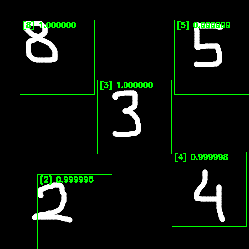

# mnist_cpp
Training a network on the mnist_dataset in tensorflow and then deploying it in C++.

## Run Object Detector 
Note: Object detection is performed by using a sliding window to divide the image into small chunks, and then each of them is classified separately. Non-maximum suppression is used to get the final result.
```bash
bazel run //application/src:object_detector -- /ABSOLUTE/PATH/TO/mnist_cpp/assets/ckpts /ABSOLUTE/PATH/TO/mnist_cpp/assets/imgs/multi.png
```


## Run classification
```bash
bazel run //application/src:classification -- /ABSOLUTE/PATH/TO/mnist_cpp/assets/ckpts /ABSOLUTE/PATH/TO/mnist_cpp/assets/imgs/single.png
```


## Run training
Download the mnist_dataset. The data should be located in `mnist_cpp/data/mnist`.
```bash
python python/dataloader/utils.py
```

Run model training:
```bash
bazel run //python/tools:train -- --path /ABSOLUTE/PATH/TO/mnist_cpp/
```

## Run inference in python
```bash
bazel run //python/tools:run_inference -- --path /ABSOLUTE/PATH/TO/mnist_cpp/
```

## Run on Docker Container 
Build the docker container 
```
cd mnist_cpp/docker
bash build_docker.sh
```
Run the docking container 
```
cd mnist_cpp/docker
bash run_docker.sh
```